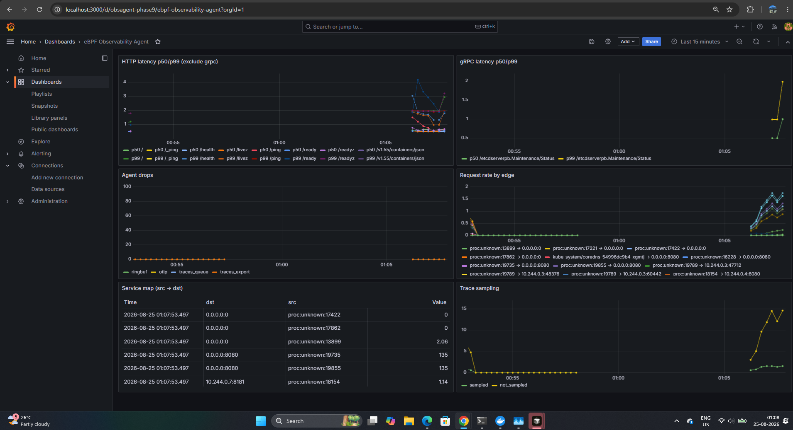

# eBPF Observability Agent

**Zero-instrumentation** HTTP/gRPC observability for Linux nodes — reconstruct latency and a live service map from kernel syscalls and OpenSSL uprobes, with **no application SDK**.

Built in **Rust + [Aya](https://aya-rs.dev/)** (eBPF). Deploys as a Kubernetes **DaemonSet**. Exports **OpenTelemetry** (OTLP) metrics and sampled traces.

---

## Results at a glance

Validated on **WSL2 + k3s** (claim lock **10/10**, 2026-08-25):

| Capability | Result |
|---|---|
| HTTP / HTTPS latency | Injectable `/slow` **50 ms** → observed p50 ≈ **50.7 ms** |
| gRPC / HTTP/2 | Cleartext gRPC + OpenSSL HTTP/2 gates **PASS** |
| Dual-plane TLS | Content latency + wire timing join; handshake via `SSL_do_handshake` |
| Service map | Named edge **`demo/frontend` → `demo/api`** on a real node |
| OTLP + Grafana | Metrics + sampled traces scraped end-to-end |
| Overhead (pin load) | HTTP **500/s** + gRPC **~200/s**, 60s × 3 → **~87% of one core** (`perf stat`) |
| Overload | RingBuf drops visible; sticky sampling engages (`sample_n=2`); RSS stable |
| CPU profiles | Optional join of stacks onto slow spans (`OBSAGENT_PROFILE=1`) |

> Overhead is **measured**, not aspirational. This project does **not** claim “under 2% CPU.”

**Project status:** [Goals achieved — why this is complete](docs/GOALS-AND-SUCCESS.md) (claim lock **10/10**).



---

## What it does

APM SDKs require changing every service. This agent attaches to the **kernel** and **libssl** instead:

1. **Capture** — syscall tracepoints (`connect`/`accept`, `read`/`write`/`writev`/…) and OpenSSL uprobes (`SSL_read`/`SSL_write`, handshake).
2. **Transport** — compact events on a **RingBuf**; under pressure, **drop + counter** (never block the kernel).
3. **Reconstruct** — pair requests/responses with a `(process, fd)` state machine (HTTP/2 adds `stream_id`); parse in userspace.
4. **Export** — per-route latency histograms, service-map edges, OTLP metrics/traces; optional CPU stacks on slow requests.

```
  Apps (no SDK)                    Linux kernel (eBPF)                 Agent (userspace)
 ┌──────────────┐                 ┌──────────────────┐               ┌────────────────────┐
 │ HTTP / gRPC  │──syscalls──────►│ Tracepoints      │──RingBuf─────►│ Correlate + parse  │
 │ OpenSSL TLS  │──uprobes───────►│ + OpenSSL hooks  │               │ Service map        │
 └──────────────┘                 │ DROPS / SAMPLE_N │               │ OTLP → collector   │
                                  └──────────────────┘               └────────────────────┘
```

**Scope (honest):** OpenSSL 1.1/3.x plaintext path; not rustls/Go `crypto/tls`. Single-node DaemonSet model; not multi-cluster APM. Privileged host agent — treat as a trust boundary.

---

## Quick demo (Kubernetes)

**Needs:** Linux node with BTF (`ls /sys/kernel/btf/vmlinux`), Docker, `kubectl`, a cluster (kind / k3s / similar), and privileges for BPF.

```bash
# 1. Build the agent image
docker build -f deploy/Dockerfile -t ebpf-obs-agent:latest .

# 2. Load into the cluster (example: kind)
kind load docker-image ebpf-obs-agent:latest
# k3s: import with your usual ctr/nerdctl path

# 3. Deploy RBAC, collector, agent, demo apps
kubectl apply -f deploy/k8s/rbac.yaml
kubectl apply -f deploy/k8s/otel-collector.yaml
kubectl apply -f deploy/k8s/configmap.yaml
kubectl apply -f deploy/k8s/daemonset.yaml
kubectl apply -f demos/microservices/k8s.yaml

# 4. Watch the agent (headless metrics)
kubectl -n observability logs -f ds/ebpf-obs-agent

# 5. Scrape OTLP metrics via the collector Prometheus exporter
kubectl -n observability port-forward svc/otel-collector 8889:8889
# open http://127.0.0.1:8889/metrics  — look for http_* / obsagent_* series
```

You should see HTTP routes, latency percentiles, and edges such as **frontend → api** once traffic flows in the demo namespace.

**Capabilities (DaemonSet):** `CAP_BPF`, `CAP_PERFMON`, `CAP_SYS_PTRACE`, `CAP_SYS_RESOURCE`, `hostPID: true`, plus BTF / `/host/proc` / cgroup mounts. See `deploy/k8s/daemonset.yaml`.

---

## Local run (Linux / WSL2)

Build and run on a Linux host with BTF (WSL2 Ubuntu is the supported Windows path):

```bash
# Toolchain (once)
curl --proto '=https' --tlsv1.2 -sSf https://sh.rustup.rs | sh
rustup install stable && rustup install nightly --component rust-src
cargo install bpf-linker
sudo apt install -y build-essential clang llvm pkg-config

# From the repo (WSL helper strips CRLF and sets CARGO_TARGET_DIR)
./scripts/wsl-run.sh build
sudo ./scripts/wsl-run.sh smoke9          # OTLP path smoke (needs collector or skip)
# Correctness examples (root + BPF):
sudo ./scripts/wsl-run.sh correctness6    # writev + split-header latency
sudo ./scripts/wsl-run.sh correctness7-grpc
```

Headless agent against local traffic (after `./scripts/wsl-run.sh build`):

```bash
export CARGO_TARGET_DIR="${CARGO_TARGET_DIR:-$HOME/.cache/obsagent-target}"
sudo OBSAGENT_HEADLESS=1 RUST_LOG=info \
  "$CARGO_TARGET_DIR/release/obsagent"
# Optional: OBSAGENT_OTLP=1 OTEL_EXPORTER_OTLP_ENDPOINT=http://127.0.0.1:4318
# Optional: OBSAGENT_PROFILE=1   # CPU stacks on slow spans
```

---

## Stack

| Layer | Choice |
|---|---|
| eBPF | Aya (Rust, CO-RE / BTF) |
| Kernel | Linux **5.15+** with `/sys/kernel/btf/vmlinux` |
| Userspace | Rust, Tokio |
| Export | OTLP/HTTP → OpenTelemetry Collector → Prometheus / Grafana |
| Deploy | Kubernetes DaemonSet |

---

## Repository layout

```
agent/          # Userspace binary (drain, correlate, OTLP)
ebpf/           # eBPF programs + maps
common/         # Shared #[repr(C)] event ABI
testdata/       # Deterministic HTTP / gRPC / writev probes
deploy/         # Dockerfile + DaemonSet / RBAC / collector
demos/          # Microservices manifest for the named-edge demo
scripts/        # Smoke, correctness, overhead, e2e helpers
docs/           # Architecture notes, overhead table, security
```

---

## Security

The agent can observe **TLS plaintext** at the OpenSSL boundary and requires elevated capabilities. Deploy node-scoped with least privilege, redact sensitive headers before export, and treat the process as a high-value trust boundary. See [`docs/security.md`](docs/security.md).

---

## License

MIT OR Apache-2.0 (see workspace `Cargo.toml`).
