# Project deep dive — eBPF Observability Agent

**Audience:** you (or another agent) picking this up cold and needing *everything*: what it is, what exists on disk, how bytes move from syscall → metric, and what is intentionally unfinished.

**Status as of 2026-08-10/11:** Phases **0–3** implemented. Phase 3 base committed (`49e7af5`); post-review fixes (client-only TLS pairing, inode dedupe, `SSL_free`/`FD_SSL`, separate `_ex` pending map) may still be dirty — see [`docs/handoff/SESSION-2026-08-10-phase-3.md`](../handoff/SESSION-2026-08-10-phase-3.md).

**Dev environment:** Windows checkout at `c:\projects\eBPF-Observability-Agent`; **build and run only inside WSL2 Ubuntu**. Never compile BPF on Windows.

---

## Table of contents

1. [One-sentence pitch](#1-one-sentence-pitch)
2. [Problem & design philosophy](#2-problem--design-philosophy)
3. [System architecture](#3-system-architecture)
4. [Repository & crate map](#4-repository--crate-map)
5. [What we implemented by phase](#5-what-we-implemented-by-phase)
6. [Shared ABI (`common/`)](#6-shared-abi-common)
7. [Kernel maps & programs (`ebpf/`)](#7-kernel-maps--programs-ebpf)
8. [Code flow — Phase 1 connect/accept](#8-code-flow--phase-1-connectaccept)
9. [Code flow — Phase 2 cleartext HTTP](#9-code-flow--phase-2-cleartext-http)
10. [Code flow — Phase 3 HTTPS / OpenSSL](#10-code-flow--phase-3-https--openssl)
11. [Userspace agent pipeline](#11-userspace-agent-pipeline)
12. [Correlation state machine](#12-correlation-state-machine)
13. [HTTP parse & aggregation](#13-http-parse--aggregation)
14. [Agent bootstrap & attach](#14-agent-bootstrap--attach)
15. [File-by-file catalog](#15-file-by-file-catalog)
16. [Testing, gates & overhead](#16-testing-gates--overhead)
17. [Security & redaction](#17-security--redaction)
18. [Known limits & non-goals](#18-known-limits--non-goals)
19. [How to run](#19-how-to-run)
20. [Related docs index](#20-related-docs-index)

---

## 1. One-sentence pitch

A **Rust + Aya** agent that attaches **tracepoints** and **OpenSSL uprobes** in the kernel, captures compact events on a **RingBuf**, and reconstructs **per-endpoint HTTP(S) latency histograms** in userspace — **without any SDK** in the target application.

---

## 2. Problem & design philosophy

### The problem

Classic APM requires inserting an SDK into every service. This project flips that: watch the kernel (syscalls) and TLS libraries (uprobes), then reconstruct application semantics (HTTP request/response pairs, latency percentiles).

Hard parts the codebase is built around:

| Hard part | How we handle it |
|---|---|
| eBPF verifier (tiny stack, no unbounded loops, checked memory) | Keep BPF dumb: stash pointers on enter, copy bounded prefix on exit, filter early |
| No request IDs in the kernel | Correlate by `(tgid, fd)` state machine |
| TLS encrypts before the wire | Uprobe `SSL_read`/`SSL_write` (+ `_ex`) *before* encryption; map `SSL*` → fd via `SSL_set_fd` |
| Kernel memory under load | RingBuf + drop counter (never block the kernel) |

### Philosophy (locked product choices)

- **Tracepoints** preferred over fragile kprobes on syscall internals.
- **RingBuf** over PerfEventArray for kernel→user transport.
- **Drop + counter** under backpressure (visible loss beats unbounded RAM).
- **Parse HTTP in userspace** (`httparse`), never in BPF.
- **Metrics-only UI** — never log raw buffer prefixes.
- Phase 3 is **TLS-only latency** (same SM as cleartext), **not** a dual-plane “TLS content + syscall wire timing” merger.

---

## 3. System architecture

### 3.1 Big picture

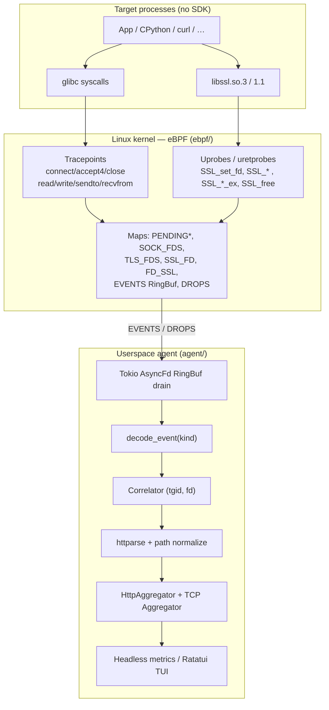

### 3.2 Logical layers

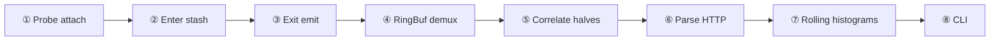

| Layer | Responsibility | Code |
|---|---|---|
| ① Attach | Load ELF, attach TPs/uprobes | `agent/src/main.rs` |
| ② Enter stash | Save buf ptr / SSL* / sockaddr | `ebpf/src/main.rs` |
| ③ Exit emit | Copy prefix, filter, RingBuf write | `emit` / `emit_io_kind` |
| ④ Demux | `EventKind` → typed event | `agent/src/decode.rs` |
| ⑤ Correlate | Pair request + response halves | `agent/src/correlate.rs` |
| ⑥ Parse | Method, path, status | `agent/src/http.rs` |
| ⑦ Aggregate | 60s window, p50/p95/p99, 4xx/5xx | `http_agg.rs`, `agg.rs` |
| ⑧ Present | Headless lines or Ratatui | `main.rs` |

### 3.3 Event kinds on one RingBuf

All events share the **first byte** as `EventKind`. Userspace branches on that byte.

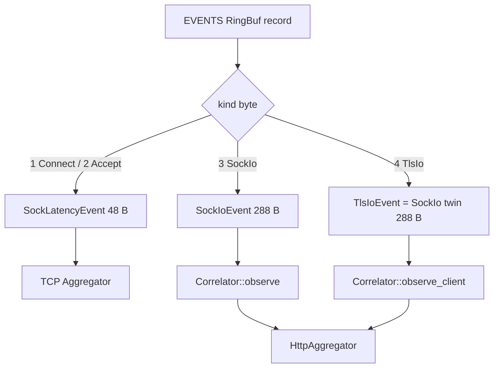

---

## 4. Repository & crate map

### 4.1 Actual workspace (as built)

> Note: older `FOLDER_STRUCTURE.md` describes *aspirational* splits (`connect.rs`, `otel/`, …). **Reality today:** nearly all BPF lives in one `ebpf/src/main.rs`; agent modules are flat files under `agent/src/`. Prefer this deep dive for “what exists.”

```text
eBPF-Observability-Agent/
├── Cargo.toml                 # workspace: agent, common, default-members
├── rust-toolchain.toml
├── .cargo/config.toml         # runner=sudo -E (override for unit tests)
├── common/                    # no_std ABI shared with BPF
├── ebpf/                      # bpfel-unknown-none program crate
├── agent/                     # userspace binary (loads probes via build.rs)
├── xtask/                     # build helpers (secondary)
├── testdata/
│   ├── latency-server/        # Axum cleartext delay server (Phase 2)
│   ├── http-probe/            # Rust HTTP client probe (Phase 2)
│   ├── https-latency-server.py
│   └── https-probe.py         # Python OpenSSL HTTPS (Phase 3)
├── scripts/                   # smoke*, correctness*, overhead*, wsl-run
├── docs/                      # architecture, phases, handoffs, security
├── benches/                   # load scripts
├── demos/                     # placeholder READMEs
└── deploy/                    # Phase 4 stubs
```

### 4.2 Crate dependency graph

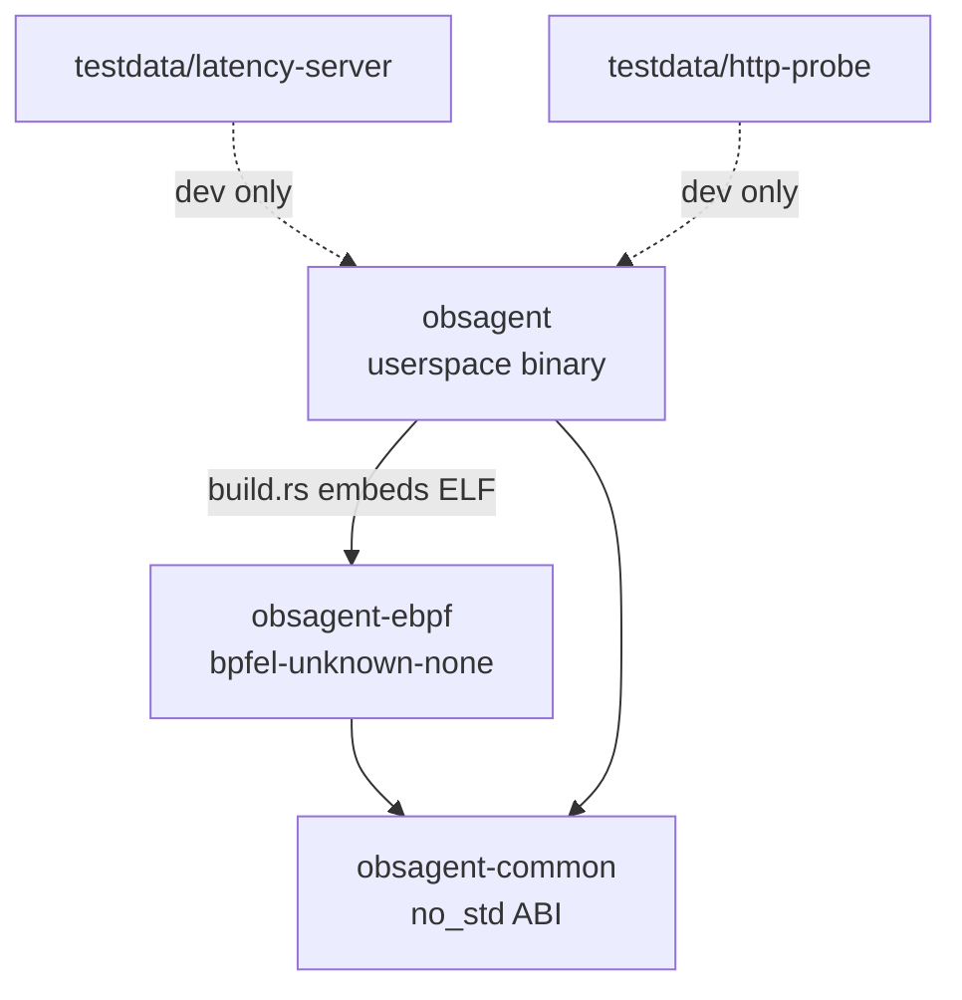

| Crate | Target | Role |
|---|---|---|
| `obsagent-common` | host + BPF | Shared `#[repr(C)]` structs, constants, enums |
| `obsagent-ebpf` | `bpfel-unknown-none` | All probes + maps in one ELF (`probes`) |
| `obsagent` | host (Linux) | Load, attach, drain, correlate, UI |
| `latency-server` / `http-probe` | host | Cleartext correctness fixtures |

`ebpf` is **excluded** from workspace default members so `cargo build --workspace` does not try to compile it for the host.

---

## 5. What we implemented by phase

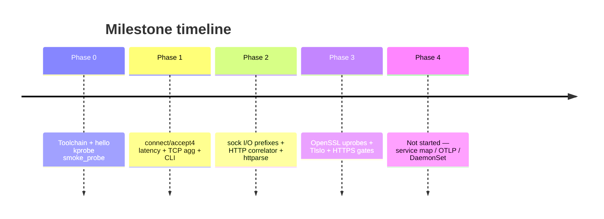

### Phase 0 — Foundations ✅

- Aya workspace, BTF, `bpf-linker`, nightly for eBPF.
- Opt-in `smoke_probe` kprobe (`OBSAGENT_SMOKE_PROBE=1`).
- Evidence: `docs/testing/phase-0.tdd.md`, `scripts/smoke-milestone0.sh`.

### Phase 1 — Connect/accept latency MVP ✅

- Tracepoints: `sys_enter/exit_connect`, `sys_enter/exit_accept4`.
- `PENDING` map (tid → enter ts + sockaddr), `EVENTS` RingBuf, `DROPS`.
- `SockLatencyEvent` (48 B): enter→exit syscall latency (not full TCP RTT).
- Userspace TCP rolling aggregator + Ratatui/headless.
- Evidence: `docs/testing/phase-1.tdd.md`, `smoke1`, `overhead` Phase 1 row.

### Phase 2 — Cleartext HTTP ✅

- Tracepoints: `read`/`write`/`sendto`/`recvfrom` (+ `close` hygiene).
- `SOCK_FDS` mark on successful connect/accept; filter on I/O enter.
- `SockIoEvent` (288 B) with 256 B prefix; HTTP magic filter on exit.
- Userspace correlator `(tgid, fd)`, `httparse`, path `:id` normalize, HTTP agg.
- Dual UI: HTTP default, `t` toggles TCP.
- Testdata: Axum `latency-server` + `http-probe`.
- Evidence: `smoke2`, `correctness2`, `docs/testing/phase-2.tdd.md`.

### Phase 3 — OpenSSL HTTPS ✅

- Uprobes: `SSL_set_fd` (+ rfd/wfd), classic `SSL_read`/`write`, **`SSL_*_ex`**, optional `SSL_free`.
- Maps: `SSL_FD`, `TLS_FDS`, `PENDING_TLS` / `PENDING_TLS_EX`, `FD_SSL`.
- `EventKind::TlsIo`; skip sock I/O on TLS fds (Q8).
- Soft-fail attach if no libssl — cleartext still works.
- Testdata: Python stdlib ssl (system OpenSSL), **not rustls**.
- Post-review: **client-only** TLS HTTP pairing; inode dedupe of libssl paths.
- Evidence: `smoke3`, `correctness3`, `docs/testing/phase-3.tdd.md`.

### Phase 4 — Not started

Service map, cgroup→pod identity, OTLP, Grafana, DaemonSet. See `docs/phases/phase-4.md`, `docs/ROADMAP.md`.

---

## 6. Shared ABI (`common/`)

**File:** `common/src/lib.rs`  
**Rules:** `#![no_std]`, `#[repr(C)]`, fixed sizes, no heap. Layouts are the **contract** between kernel and agent.

### 6.1 Constants

| Constant | Value | Meaning |
|---|---|---|
| `EVENTS_RINGBUF_BYTES` | 256 KiB | RingBuf size (power of two) |
| `PENDING_MAP_ENTRIES` | 8192 | Max pending / fd-table map entries |
| `SOCK_IO_PREFIX_LEN` | 256 | Max captured plaintext/HTTP prefix |
| `AF_INET` | 2 | IPv4 only (Phase 1+) |

### 6.2 Enums

```text
EventKind: Connect=1 | Accept=2 | SockIo=3 | TlsIo=4
IoDir:     Read=1    | Write=2
```

Wire format uses raw `u8`; userspace converts with `from_u8`.

### 6.3 Event layouts

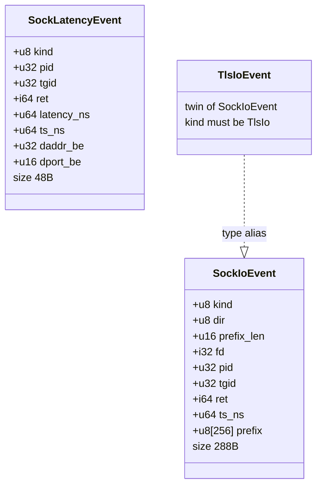

### 6.4 Pending (map-only) structs

| Struct | Size | Used by |
|---|---|---|
| `PendingEnter` | enter ts + addr or sockaddr ptr | connect/accept |
| `PendingIo` | `buf_ptr`, `fd`, `dir` | sock I/O |
| `PendingTls` | `buf_ptr`, `ssl_ptr`, `outlen_ptr`, `dir` | TLS classic + `_ex` |

`outlen_ptr != 0` means `SSL_*_ex`: on success (`ret == 1`), byte count is read from `*outlen_ptr`.

---

## 7. Kernel maps & programs (`ebpf/`)

**File:** `ebpf/src/main.rs` (single compilation unit → ELF name `probes`).

### 7.1 Maps

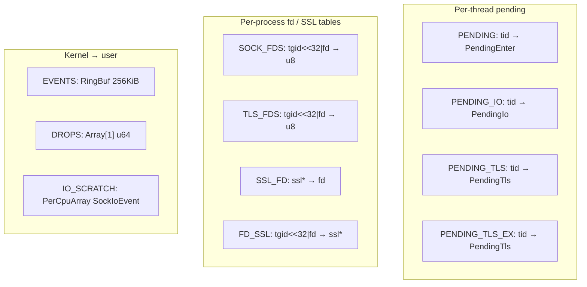

| Map | Key | Value | Why |
|---|---|---|---|
| `PENDING` | tid | `PendingEnter` | Pair connect/accept enter↔exit |
| `PENDING_IO` | tid | `PendingIo` | Pair sock I/O enter↔exit |
| `PENDING_TLS` | tid | `PendingTls` | Classic SSL_read/write |
| `PENDING_TLS_EX` | tid | `PendingTls` | Separate so classic/`_ex` cannot clobber |
| `SOCK_FDS` | `(tgid,fd)` | marker | Only track fds from connect/accept |
| `TLS_FDS` | `(tgid,fd)` | marker | Skip sock I/O (ciphertext) |
| `SSL_FD` | `ssl*` | fd | Q1: recover fd on SSL I/O exit |
| `FD_SSL` | `(tgid,fd)` | `ssl*` | Reverse map for close/`SSL_free` cleanup |
| `EVENTS` | — | RingBuf | All typed events |
| `DROPS` | index 0 | u64 | Failed `reserve` count |
| `IO_SCRATCH` | cpu | `SockIoEvent` | Avoid BPF stack overflow building 288 B events |

### 7.2 Attached programs (inventory)

| Program name | Type | Attach point |
|---|---|---|
| `smoke_probe` | kprobe | `try_to_wake_up` (opt-in) |
| `enter_connect` / `exit_connect` | tracepoint | `syscalls/sys_*_connect` |
| `enter_accept4` / `exit_accept4` | tracepoint | `syscalls/sys_*_accept4` |
| `enter_close` | tracepoint | `syscalls/sys_enter_close` |
| `enter_*` / `exit_*` | tracepoint | read, write, sendto, recvfrom |
| `enter_ssl_set_fd` | uprobe | `SSL_set_fd`, optional `SSL_set_rfd`/`wfd` |
| `enter_ssl_free` | uprobe | `SSL_free` (optional) |
| `enter/exit_ssl_write` | uprobe/uretprobe | `SSL_write` |
| `enter/exit_ssl_read` | uprobe/uretprobe | `SSL_read` |
| `enter/exit_ssl_write_ex` | uprobe/uretprobe | `SSL_write_ex` |
| `enter/exit_ssl_read_ex` | uprobe/uretprobe | `SSL_read_ex` |

Tracepoint field offsets (`ENTER_FD_OFF=16`, etc.) are pinned to **WSL2 6.6** format files — if you move kernels, re-verify offsets.

---

## 8. Code flow — Phase 1 connect/accept

### 8.1 Connect (client)

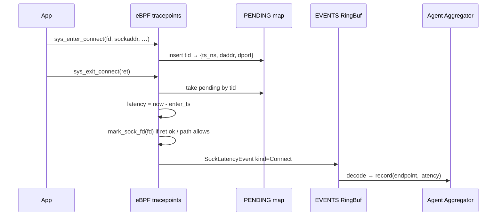

**Semantics:** `latency_ns` is **syscall enter→exit** only. Non-blocking connect returning `-EINPROGRESS` measures the syscall, **not** TCP handshake completion. Documented in `common` module docs.

### 8.2 Accept4 (server)

Similar pairing: enter stores `sockaddr_ptr` (often filled by kernel on exit); exit reads peer IPv4 via `bpf_probe_read_user`, emits `kind=Accept`, marks the **new** fd in `SOCK_FDS`.

### 8.3 Close hygiene

`enter_close` → `unmark_sock_fd`: removes `SOCK_FDS`, `TLS_FDS`, and (via `FD_SSL`) matching `SSL_FD` entries so maps do not leak across fd reuse.

---

## 9. Code flow — Phase 2 cleartext HTTP

### 9.1 Why sendto/recvfrom?

glibc `TcpStream` often uses **`sendto`/`recvfrom`**, not `write`/`read`. Phase 2 attaches all four. Server-side `sendmsg`/`writev` are **not** attached (documented limit) — cleartext correctness usually sees the **client** half.

### 9.2 Dual filter (cheap then precise)

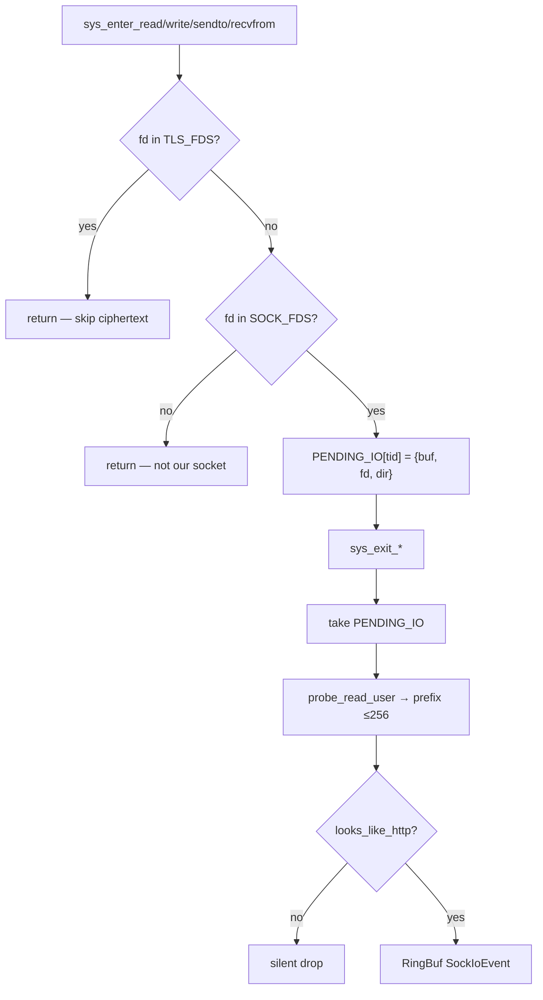

**Enter filter (`SOCK_FDS`):** avoids stashing for every pipe/file read on the box.  
**Exit filter (HTTP magic):** `GET `/`POST `/`HTTP/`… — drops SSH and noise on marked sockets.

### 9.3 Cleartext client example

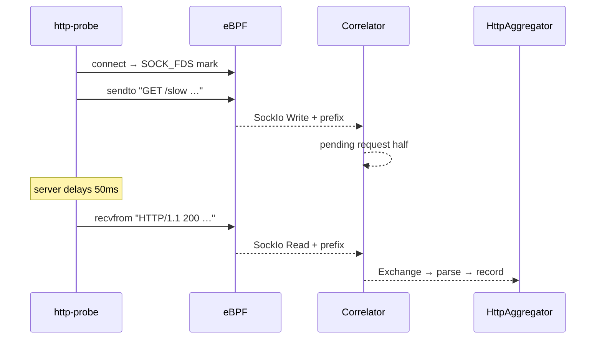

HTTP latency = **response-half exit `ts_ns` − request-half exit `ts_ns`** (not syscall duration).

---

## 10. Code flow — Phase 3 HTTPS / OpenSSL

### 10.1 Why uprobes?

After `SSL_write`, the kernel only sees ciphertext. We intercept **plaintext** inside libssl, still keyed by the underlying socket fd.

### 10.2 SSL* → fd binding (Q1)

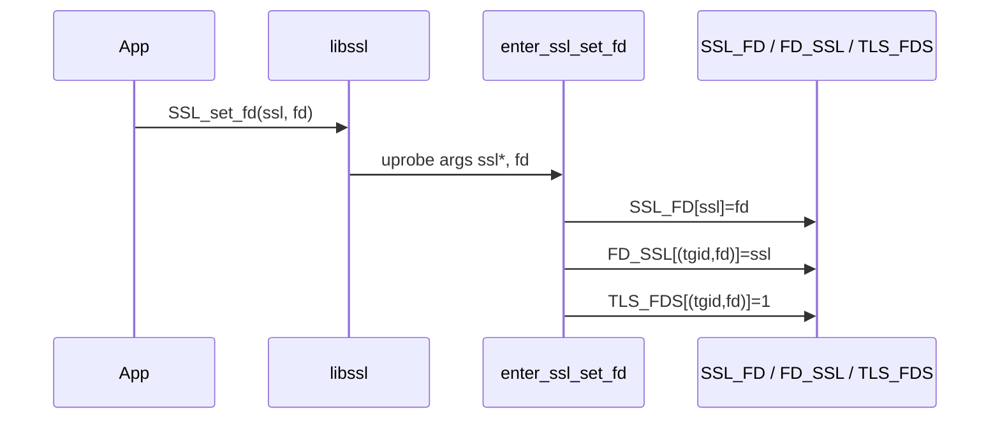

If an SSL I/O exit cannot find `SSL_FD[ssl]`, the event is **dropped** (no inventing fds).

### 10.3 Classic vs `_ex`

| API | Enter stash | Exit length |
|---|---|---|
| `SSL_write` / `SSL_read` | `PENDING_TLS` | `uretprobe` return = byte count |
| `SSL_write_ex` / `SSL_read_ex` | `PENDING_TLS_EX` | success iff ret==1; bytes from `*arg3` |

**Empirical fact:** CPython 3.x `_ssl` uses **`_ex`**, not classic. Both families are attached.

### 10.4 Full HTTPS path

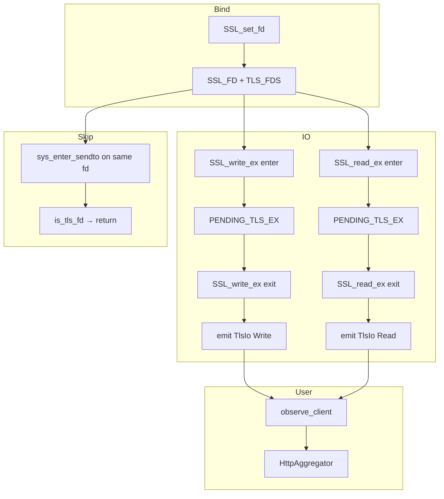

### 10.5 Client-only TLS pairing (post-review)

Same-host OpenSSL **client and server** both emit `TlsIo`. Feeding both into the same `(METHOD, path)` key **doubled** counts (`repeat=5` → `count=10`).

**Fix:** `TlsIo` uses `Correlator::observe_client` — only **write→read** (client) completes an exchange. Server **read→write** is ignored for HTTP metrics. Cleartext `SockIo` still allows both directions via `observe`.

`tlsio` counters still count raw events (including server); `http_60s` / endpoint `count` reflect client-only exchanges.

### 10.6 Soft-fail attach

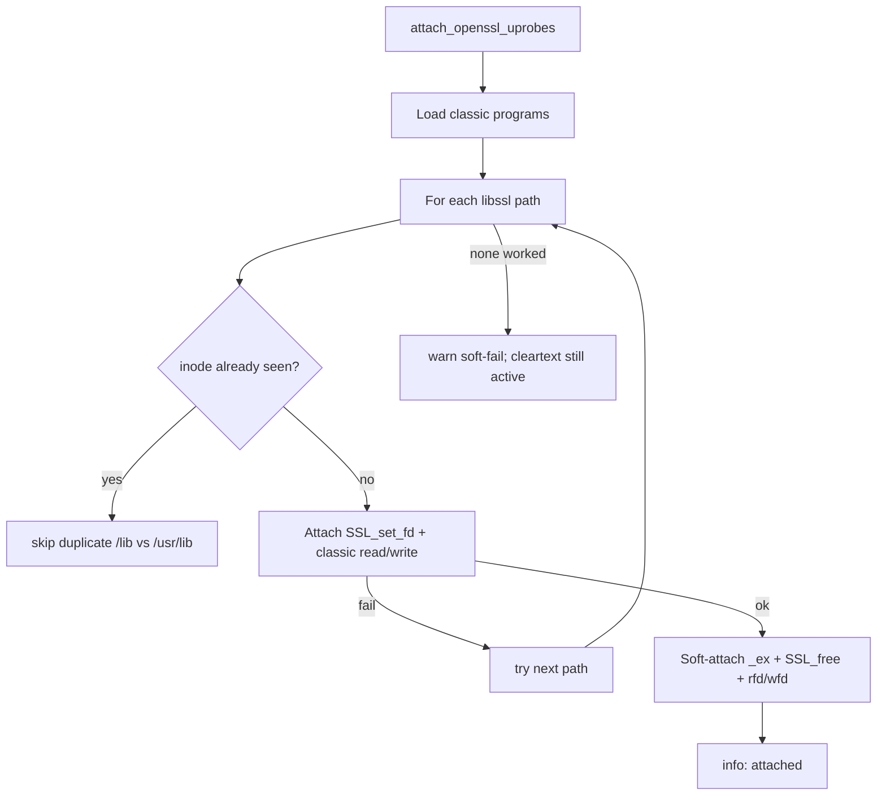

---

## 11. Userspace agent pipeline

**File:** `agent/src/main.rs` (drain task) + modules below.

### 11.1 Drain loop

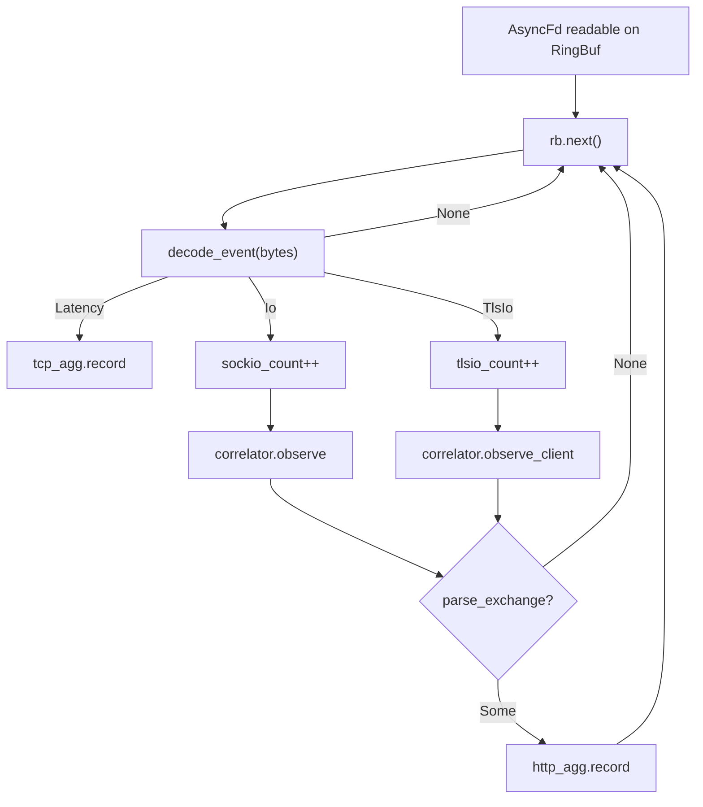

Also every 1s: push event rate sparkline sample; refresh `DROPS[0]` into `drop_count`.

### 11.2 Presentation

| Mode | Trigger | Output |
|---|---|---|
| Headless | `OBSAGENT_HEADLESS=1` or non-TTY | `events_60s=… http_60s=… sockio=… tlsio=… drops=…` + top rows |
| TUI | interactive terminal | Ratatui table; `t` toggles TCP ↔ HTTP; `q` quits |

---

## 12. Correlation state machine

**File:** `agent/src/correlate.rs`  
**Key:** `SockKey { tgid, fd }`  
**Timeout:** 60s stale pending eviction (aligned with agg window).

### 12.1 States

```mermaid
stateDiagram-v2
  [*] --> Idle
  Idle --> PendingReq: request-looking half\n(observe: any dir;\nobserve_client: Write only)
  PendingReq --> Idle: opposite half looks like HTTP/ response\n→ emit Exchange
  PendingReq --> PendingReq: new request-looking half\n(restart)
  PendingReq --> Idle: timeout > 60s
```

### 12.2 Rules

| Rule | Behavior |
|---|---|
| Start | Prefix must look like HTTP request (`GET `, `POST `, …) |
| Complete | Opposite direction + prefix looks like `HTTP/` |
| Latency | `t_end_ns - t_start_ns` (both exit timestamps) |
| `observe` | Write↔Read **or** Read↔Write |
| `observe_client` | **Only** Write then Read |
| Restart | Same-direction new request replaces pending |

### 12.3 Documented limits

- No TCP reassembly — first HTTP-looking chunk per half only.
- Mid-stream slices that do not start with a method / `HTTP/` never join.
- Pipelining can mis-pair (accepted risk for M2/M3).

---

## 13. HTTP parse & aggregation

### 13.1 Parse (`agent/src/http.rs`)

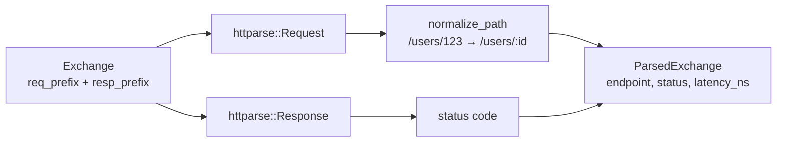

- Query string stripped before normalize (`/slow?delay_ms=50` → `/slow`).
- Partial httparse results accepted (truncated 256 B headers).
- `redact_headers` exists for future export — **not** called on the hot path (metrics-only UI).

### 13.2 HTTP aggregator (`agent/src/http_agg.rs`)

- Key: `HttpEndpoint { method, path }`.
- Rolling **60s** `VecDeque` of samples.
- Each `rows()` rebuilds an `hdrhistogram` for p50/p95/p99; computes 4xx/5xx %.
- Sorted by count descending for CLI.

### 13.3 TCP aggregator (`agent/src/agg.rs`)

Same rolling-window idea for `SockLatencyEvent`, keyed by remote IP:port + Connect/Accept.

---

## 14. Agent bootstrap & attach

### 14.1 Startup sequence

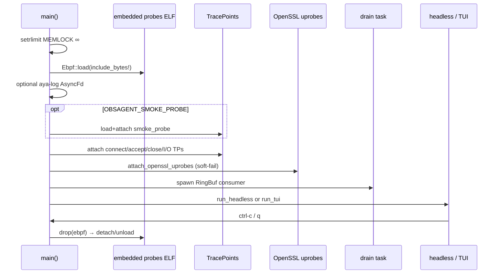

### 14.2 Build embedding

`agent/build.rs` builds the eBPF crate and embeds the object via `aya::include_bytes_aligned!(concat!(env!("OUT_DIR"), "/probes"))`. A release rebuild is required after eBPF edits before root gates see the change (`scripts/correctness-phase3.sh` runs the **prebuilt** release binary).

---

## 15. File-by-file catalog

### 15.1 Core runtime

| Path | What it does |
|---|---|
| `common/src/lib.rs` | Entire kernel↔user ABI; layout tests |
| `ebpf/src/main.rs` | All maps + all BPF programs |
| `ebpf/src/lib.rs` | Crate root / re-exports for BPF build |
| `ebpf/build.rs` | BPF build glue |
| `agent/build.rs` | Compile eBPF + emit `OUT_DIR/probes` |
| `agent/src/main.rs` | Load/attach, drain, TUI/headless, OpenSSL attach |
| `agent/src/decode.rs` | RingBuf → `DecodedEvent` |
| `agent/src/correlate.rs` | HTTP exchange SM (`observe` / `observe_client`) |
| `agent/src/http.rs` | Parse, normalize, redact helper |
| `agent/src/http_agg.rs` | Per-endpoint HTTP histograms |
| `agent/src/agg.rs` | Per-endpoint TCP connect/accept histograms |

### 15.2 Testdata

| Path | Phase | Role |
|---|---|---|
| `testdata/latency-server/` | 2 | Axum server with injectable delay/status |
| `testdata/http-probe/` | 2 | Multi-path HTTP client |
| `testdata/https-latency-server.py` | 3 | stdlib `ssl` HTTPS server |
| `testdata/https-probe.py` | 3 | stdlib `ssl` HTTPS client |
| `testdata/README.md` | — | Which fixture to use when |

### 15.3 Scripts

| Path | Role |
|---|---|
| `scripts/wsl-run.sh` | Canonical entry: build, test-*, smoke*, correctness* |
| `scripts/wsl_exec.py` | Strip CR from scripts under `/mnt/c`, then bash |
| `scripts/smoke-milestone{0,1,2,3}.sh` | Attach + unload gates |
| `scripts/correctness-phase{2,3}.sh` | p50 vs injected delay band |
| `scripts/overhead-phase{1,2,3}*.sh` | CPU/RSS samples |
| `scripts/preflight.sh` | BTF / toolchain checks |
| `scripts/debug-ssl-symbols.sh` | Inspect libssl exports |

### 15.4 Docs (navigation)

| Path | Role |
|---|---|
| `docs/architecture/*` | Stable design (overview, correlation, TLS, data-flow) |
| `docs/phases/*` | Checklists + implementation plans + locked Qs |
| `docs/testing/phase-*.tdd.md` | Gate evidence |
| `docs/handoff/SESSION-*.md` | Session resume packs |
| `docs/security.md` | Trust boundary / redaction |
| `docs/overhead.md` | Measured overhead table |
| `docs/ROADMAP.md` | Phase checklist (may lag phase-*.md) |

### 15.5 Not yet real (placeholders)

`deploy/`, `demos/*` READMEs, OTLP modules, service-map modules — **Phase 4+**. Do not expect working code there.

---

## 16. Testing, gates & overhead

### 16.1 Unit tests

| Command | Approx count | Covers |
|---|---|---|
| `wsl-run.sh test-common` | 12 | ABI sizes, kind roundtrips, TlsIo twin |
| `wsl-run.sh test-agent` | 23 | decode, correlate (+ client_only), http, aggs |

Unit tests **must** override cargo runner (`wsl-run.sh` uses `runner=env`) or they hang on `sudo -E`.

### 16.2 Integration gates (root)

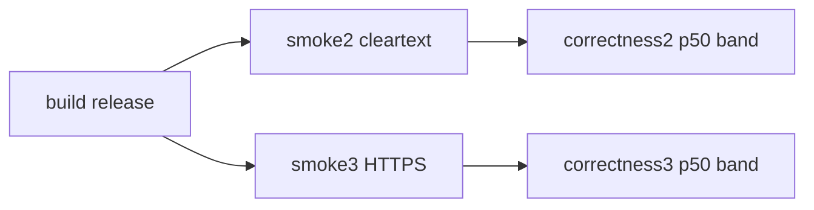

| Gate | Pass criteria (summary) |
|---|---|
| smoke2 | sockio + HTTP rows; clean unload; no leaked pins |
| smoke3 | OpenSSL uprobes loaded; `tlsio≠0`; HTTP rows; unload |
| correctness2/3 | `GET /slow` p50 within max(±10ms, ±10%) of injected delay |

**Correctness3 healthy signature (post client-only fix):**

```text
http_60s=15 sockio=0 tlsio=60 drops=0
GET /slow count=5 ... p50≈50.x ms   # repeat=5 → count=5 not 10
```

### 16.3 Overhead (honest)

| Phase | Quick sample | Claim |
|---|---|---|
| 1 | ~1.6% `ps` | OK-ish for light connect load |
| 2 | ~10.7% burst | **Not** &lt;2% proof |
| 3 | ~3.5% burst | Quick only; not host-normalized &lt;2% |

See `docs/overhead.md`.

---

## 17. Security & redaction

| Policy | Implementation |
|---|---|
| Metrics-only UI | Headless/TUI print counts & percentiles, never prefixes |
| No raw prefix logs | Agent must not `println!` event buffers |
| Redact for future export | `redact_headers` masks Authorization/Cookie/Set-Cookie |
| Capabilities | Root / `CAP_BPF` etc. for attach (DaemonSet later) |
| Soft-fail TLS | Missing libssl does not disable cleartext path |

Details: `docs/security.md`, `docs/design-notes/tls-security.md`.

---

## 18. Known limits & non-goals

### Limits (document, don’t silently “fix”)

| Limit | Why |
|---|---|
| IPv4 only | Phase 1 Q lock |
| No `sendmsg`/`writev` | Server cleartext responses often invisible |
| No TCP reassembly / HTTP/2 / pipelining correctness | Complexity deferred |
| TLS client-only HTTP metrics | Avoids same-host OpenSSL 2× counts |
| Split rfd/wfd last-write-wins | Single `SSL_FD` slot per `ssl*` |
| Tracepoint offsets for WSL 6.6 | Other kernels need re-check |
| Aspirational &lt;2% CPU unmet on Phase 2/3 quick bursts | Need longer/perf-normalized study |

### Explicit non-goals until asked

- Dual-plane TLS↔syscall wire-timing engine  
- Go crypto/tls, rustls, BoringSSL first-class  
- gRPC / HTTP/2 frame demux  
- OTLP, Grafana, k8s identity, DaemonSet (Phase 4)  
- Splitting `main.rs` / `ebpf/main.rs` into many modules  

---

## 19. How to run

### Environment

```bash
# Always via WSL Ubuntu; strip CRLF with wsl_exec.py
export CARGO_TARGET_DIR=/home/sahil/.cache/obsagent-target
```

### From Windows PowerShell

```powershell
# Build + unit tests (user sahil)
wsl -d Ubuntu -u sahil -- python3 /mnt/c/projects/eBPF-Observability-Agent/scripts/wsl_exec.py wsl-run.sh build
wsl -d Ubuntu -u sahil -- python3 /mnt/c/projects/eBPF-Observability-Agent/scripts/wsl_exec.py wsl-run.sh test-agent

# Root gates
wsl -d Ubuntu -u root -- python3 /mnt/c/projects/eBPF-Observability-Agent/scripts/wsl_exec.py wsl-run.sh smoke3
wsl -d Ubuntu -u root -- python3 /mnt/c/projects/eBPF-Observability-Agent/scripts/wsl_exec.py wsl-run.sh correctness3
```

### Manual headless agent

```bash
wsl -d Ubuntu -u root -- bash -lc '
  export CARGO_TARGET_DIR=/home/sahil/.cache/obsagent-target
  OBSAGENT_HEADLESS=1 RUST_LOG=warn $CARGO_TARGET_DIR/release/obsagent
'
```

### Env vars

| Var | Effect |
|---|---|
| `OBSAGENT_HEADLESS=1` | Metrics print loop |
| `OBSAGENT_SMOKE_PROBE=1` | Attach Phase 0 kprobe |
| `RUST_LOG` | Logging level |
| `CARGO_TARGET_DIR` | Keep artifacts on Linux fs (fast) |

---

## 20. Related docs index

| Doc | Use when |
|---|---|
| [OVERVIEW.md](OVERVIEW.md) | Short architecture summary |
| [data-flow.md](data-flow.md) | Kernel→user path sketch |
| [correlation.md](correlation.md) | Product correlation design |
| [tls-interception.md](tls-interception.md) | TLS approach |
| [PROBE_MAP.md](PROBE_MAP.md) | Attach-point inventory |
| [phase-3-implementation-plan.md](../phases/phase-3-implementation-plan.md) | Locked Q1–Q15 |
| [SESSION-2026-08-10-phase-3.md](../handoff/SESSION-2026-08-10-phase-3.md) | Resume coding session |
| [ROADMAP.md](../ROADMAP.md) | What’s next (Phase 4) |

---

## Appendix A — End-to-end mental model (one page)

```text
┌──────────── cleartext ────────────┐  ┌──────────── HTTPS ─────────────┐
│ connect/accept → SOCK_FDS         │  │ SSL_set_fd → SSL_FD + TLS_FDS  │
│ sendto/recvfrom → SockIo          │  │ SSL_*_ex → TlsIo               │
│ correlator.observe                │  │ correlator.observe_client      │
└─────────────────┬─────────────────┘  └────────────────┬───────────────┘
                  │                                     │
                  └──────────────┬──────────────────────┘
                                 ▼
                    parse_exchange → HttpAggregator
                                 ▼
                         headless / Ratatui
```

## Appendix B — Resume checklist for a new session

1. Read [`SESSION-2026-08-10-phase-3.md`](../handoff/SESSION-2026-08-10-phase-3.md).
2. `git status` — expect possible dirty review-fix files on top of `49e7af5`.
3. `wsl-run.sh build && test-agent` → 23 passed.
4. Root `smoke3` / `correctness3` → `/slow count=5`.
5. Do **not** start Phase 4 unless the user asks.
6. Do **not** commit/push unless the user asks.
